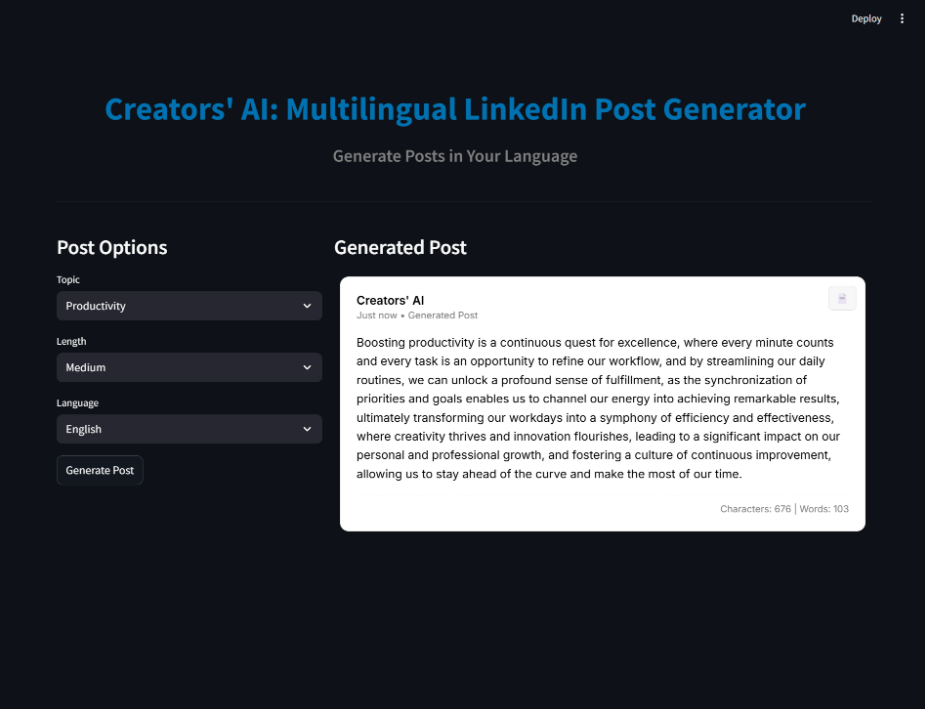

# Creators' AI: Multilingual LinkedIn Post Generator

## The Ultimate AI Tool for Professional Content Creation

This Streamlit application leverages advanced Large Language Models (LLMs) via the Groq API to generate highly engaging, professional, and language-specific LinkedIn posts.

It drastically reduces time spent brainstorming and writing posts, while ensuring content is optimized for engagement, clarity, and platform style.

## Visualization

## Features
## Multilingual Generation

Generate posts in 10+ languages, including:
English, Spanish, French, Hindi, Bengali, Tamil, Arabic — plus a special Hinglish mode.

## Length Control

Choose the required size:

   1. Short (1–5 lines)

   2. Medium (6–10 lines)

   3. Long (11–15 lines)

## Topic-Based Generation

Pick from predefined tags (Job Search, Career, Mental Health, Finance, Productivity, etc).

## Preview

custom HTML/CSS card replicates the LinkedIn look:

  1. Clean UI

 2. Profile-style header

 3. Copy-to-clipboard button

 4. Responsive layout

## Technology Stack

| Component           | Technology   | Purpose                           |

| -----------------   | ----------   | --------------------------------- |

| **Frontend / UI**   | Streamlit    | Interactive web app               |

| **LLM Inference**   | Groq API     | Ultra-fast model execution        |

| **AI Framework**    | LangChain    | Prompt templates + output parsing |

| **Data Handling**   | Pandas       | Few-shot filtering                |

## Setup and Installation

### Prerequisites

Prerequisites:

   1. Python 3.8+

  2. A Groq API Key (from the Groq Console)

### 1. Clone the Repository

   git clone <YOUR_REPO_URL>
   cd <your-repo-name>
   
### 2. Install Dependencies

  pip install -r requirements.txt

### 3. Configure API Key

  Create a .env file in the project root

### 4. Run the App

  streamlit run main.py

## Project Structure

repo

├── main.py                  # Streamlit UI

├── post_generator.py        # Prompt construction + LLM logic

├── llm_helper.py            # Groq-client initialization

├── few_shot_posts.py        # Few-shot data handling

├── data/

│   ├── raw_posts.json       # Original sample posts

│   └── processed_posts.json # Cleaned & structured posts

├── static/

│   ├── component.html       # LinkedIn preview template

│   └── component.css        # Custom styling

├── requirements.txt

├── .gitignore

└── README.md

## Internal Workflow: Control and Data Flow

The application uses a modular, LangChain-based pipeline to ensure separation of concerns and deterministic prompt generation.

Initialization (llm_helper.py): The Groq LLM client is initialized once, securely loading the API key via dotenv. This client object handles all low-latency inference calls.

### UI Data Capture and Trigger (main.py): 

Streamlit captures user parameters (Language, Length, Topic) and calls the generation function within post_generator.py.

### Context Loading and Filtering (few_shot_posts.py):

The PostDataset class uses Pandas to load and filter the internal processed_posts.json data.

It extracts optimal few-shot examples (1-2 posts) that precisely match the user's criteria (e.g., "Short, Finance, English"). This minimizes token usage while maximizing contextual relevance for the model.

### Prompt Orchestration (post_generator.py):

1. A LangChain FewShotPromptTemplate is constructed.

2. The prompt template integrates:

  ~ A clear system instruction defining the model's persona (professional content creator).

  ~ The retrieved few-shot examples (context).

  ~ The final user input variables (Topic, Length constraint, Target Language).

### Chain Execution and LLM Invocation: The complete, structured prompt is passed to the Groq LLM client. The model processes the input, using the few-shot examples as guidance for style and tone.

### Response Handling: The generated content (response text) is returned from the LLM, passed back to main.py, and immediately rendered within the custom Streamlit component, prioritizing low latency and fast display.

## Future Enhancements

1. Multi-provider model support (Gemini / OpenAI / Meta)

2. Script-language support (Devanagari, Bengali script, Tamil script)

3. AI Topic Suggestions

4. Automatic LinkedIn scheduling (Buffer, Hootsuite API)

5. Analytics: predict engagement score

## Acknowledgments

1. Groq Llama-3.3 70B

2. Streamlit

3. LangChain

